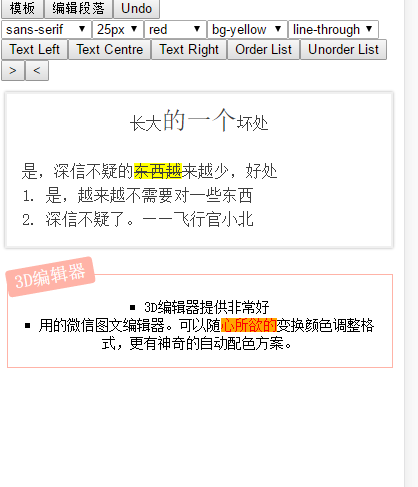
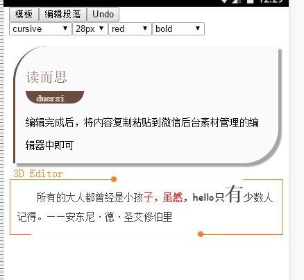

I use draft-js in my product. I need change it to support some layouts rendering.
Because the changes only focus to my product and not follow draft-js well, it is may not be merged to `facebook/draft-js` 

# Change block style dynamic

##the control object list:
---
```html
<button onClick={this.onStyleCurrentBlock.bind(this, {bTextAlign:"left"})}>Text Left</button>
<button onClick={this.onStyleCurrentBlock.bind(this, {bTextAlign:"center"})}>Text Centre</button>
<button onClick={this.onStyleCurrentBlock.bind(this, {bTextAlign:"right"})}>Text Right</button>
<button onClick={this.onStyleCurrentBlock.bind(this, {bListStyle:"decimal"})}>Order List</button>
<button onClick={this.onStyleCurrentBlock.bind(this, {bListStyle:"square"})}>Unorder List</button>
<button onClick={this.onStyleCurrentBlock.bind(this, {bMarginLeft:"more"})}>&gt;</button>
<button onClick={this.onStyleCurrentBlock.bind(this, {bMarginLeft:"less"})}>&lt;</button>
```

##the event handler:
---
```javascript
   onStyleCurrentBlock(control){
        const {editorState} = this.state;
        const contentState = editorState.getCurrentContent();
        const sel = editorState.getSelection();
        const key = sel.getStartKey();
        console.log('block style[',key,']', JSON.stringify(style));
        const block = contentState.getBlockForKey(key);
        //if(block.getLength() < 0) return;
        const blockData = block.getData();

        if(style.bMarginLeft){
            const newMarginLeft = (
                (blockData.get('bMarginLeft')||0)
                + (style.bMarginLeft==='more' ? 2 : -2)
            );
            style.bMarginLeft = newMarginLeft;
        }
        const newBlockData = blockData.merge(Map(style));
        if(newBlockData.equals(blockData)){
            return;
        }
        let nextContentState = Modifier.setBlockData(contentState,sel,newBlockData);
        const newEditState = EditorState.push(
            editorState,
            nextContentState,
            'change-block-style'
        );
        this.onChange(newEditState);
    }
```


# Decorate multiple blocks 


##the raw blocks like:
--------------------
```javascript
//refer the wrapper by 'this.props.wrapper' in blockWrapperFn
wrapper: {
    topLevel:{
        render(children, startOffset, endOffset){
            return <div
                data-offset-key={startOffset}
                key="topLevel"
                style={{
                    borderLeft: '5px solid #eeeeee',
                    margin: '5px',
                    marginRight: '7px',
                    padding: '10px 15px',
                    borderWidth: '3px',
                    borderColor: 'rgb(107, 77, 64)',
                    borderTopLeftRadius: '50px',
                    borderBottomRightRadius: '50px',
                    boxShadow: 'rgb(165, 165, 165) 5px 5px 2px',
                    backgroundColor: 'rgb(250, 250, 250)',
                }}>
                {children}
            </div>
        },
    }
},

blocks:[
    {
        type: 'blockquote',
        text: '读而思',
        blockStyle: { //you need use blockStyle in blockStyleFn prop of Editor
            marginTop: '15px',
            marginBottom: '0px',
            padding: '0px',
            lineHeight: '2em',
            fontSize: '20px',
            borderColor: 'rgb(107, 77, 64)'
        },
        inlineStyleRanges: [{
            style:{ // you need name the style and map in customStyleMap prop of Editor
                color: 'rgb(107, 77, 64)',
                fontSize: '20px',
            }
        }],
        data:{ // the block level metadata
            wrapKey:"topLevel",
        }
    },
    {
        type:'header-one',
        text:'duersi',
        blockStyle:{
            fontSize:'1em',
            fontWeight:'normal',
            margin:'0px',
            backgroundColor:'rgb(107, 77, 64)',
            borderBottomLeftRadius:'20px',
            borderBottomRightRadius:'20px',
            marginBottom:'10px',
            padding:'0px 15px',
            maxWidth:'24%',
        },
        inlineStyleRanges:[{
            style: {
                color: 'rgb(224, 209, 202)',
                fontWeight: 'bold',
                fontSize: '13px',
            },
        }],
        data:{
            wrapKey:"topLevel",
        }
    },
    {
        type:'header-two',
        text:'编辑完成后，将内容复制粘贴到微信后台素材管理的编辑器中即可',
        blockStyle:{
            fontSize:'1em',
            fontWeight:'normal',
            margin:'0px',
            marginTop: '0px',
            marginBottom: '0px',
            padding: '0px',
            lineHeight: '2em',
            minHeight: '1.5em',
        },
        inlineStyleRanges:[
            {
                style:{
                    fontSize: '14px',
                }
            }
        ],
        data:{
            wrapKey:"topLevel",
        }
    },
],
```

##the wrapperFn which organize the React elements created by Draft Editor 
-----------------------------------------------------------------------
```javascript    
    //blocks: the ContentBlocks of the editor
    //offsetKeys: the offset keys to the blocks
    //elements: React elements to the blocks
    _blockWrapperFn(blocks, offsetkeys, elements) {
        const children = [];
        for(let i =0;i<blocks.length;i++){
            const block = blocks[i];
            const wrapName = block.getData().get('wrapKey');
            if(!wrapName){
                //a block not need to be decorated
                children.push({elem:elements[i]});
            }else{
                //a block need to be decorated in "wrapName" wrapper
                let wrapChild = children.find(o=>o.wrapName == wrapName);
                if(!wrapChild){
                    wrapChild = {
                        wrapName:wrapName,
                        wrapped:[],
                        startKey:offsetkeys[i],
                    }                                                                                
                    //record elements need to be decorated in this wrapper
                    children.push(wrapChild);
                }
                wrapChild.wrapped.push(elements[i]);
                wrapChild.endKey = offsetkeys[i];
            }
        }

        return children.map(c=>{
            if(c.wrapName){
                return this.props.wrapper[c.wrapName].render(c.wrapped, c.startKey, c.endKey);
            }
            return c.elem;
        });
    }

    render() {
        return <Editor
                ...
                blockWrapperFn={this._blockWrapperFn.bind(this)}
                editorState={this.state.editorState}
                placeholder="input something..."
                onChange={this.onChange}/>;
    }
```